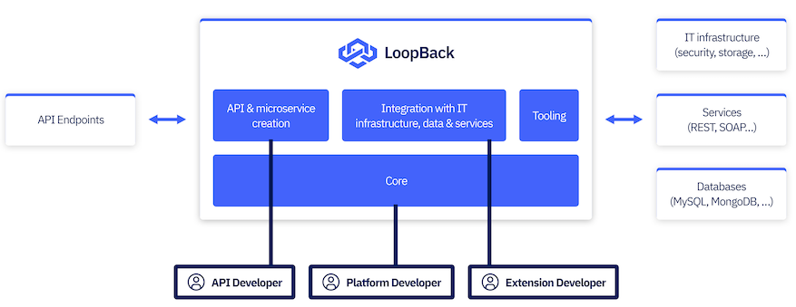

# 💁‍♂️ Node.js Microservices

This architecture encourages larger applications to be built as a set of smaller modular applications, where each application focuses on one key concern.

> [!TIP]
> Microservice architectures are a contrast to the monolithic architectures of the past.

Ensuring that an application only serves one purpose means that the application can be optimized to best serve that purpose.

Node.js microservices commonly expose **RESTful** APIs. **REST** stands for **Representational State Transfer**.

Microservice and container technology go hand in hand. Cloud and container technologies are growing in adopting, with Docker and Kubernetes being the leading choices for deploying microservice-based applications.

## #️⃣ Generating a microservice with LoopBack

LoopBack 4 : LoopBack is a highly extensible, open-source Node.js and TypeScript framework based on Express. It enables you to quickly create APIs and microservices composed from backend systems such as databases and SOAP or REST services.

The diagram below demonstrates how LoopBack serves as a composition bridge between incoming requests and outgoing integrations.



To use the LoopBack 4 command-line interface (CLI) to generate a Node.js microservice.

```sh
$ npm i -g @loopback/cli
```

To start generating

```sh
$ lb4 loopback-bookstore
```

Enter the following command to start creating a model:

```sh
$ lb4 model
```

we need to create our data source using LoopBack's data source CLI. Enter the following command in your Terminal window

```sh
$ lb4 datasource
```

we need to create a LoopBack repository. This is a LoopBack class that binds the data source and the model. Enter the following command to start the repository generator interface:

```sh
$ lb4 repository
```

we need to create a LoopBack controller. A LoopBack controller handles the API requests and responses. Enter the following command to start the controller generator interface:

```sh
$ lb4 controller
```
