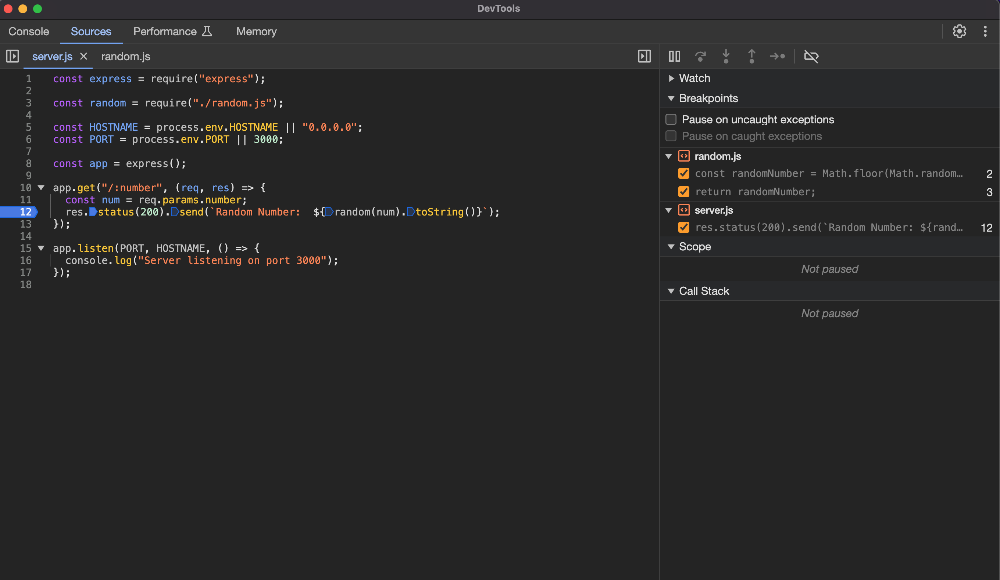

# 💁‍♂️ Debugging Node.js

Over the past decade, Node.js has matured as a technology, and the debugging capabilities and facilities have improved accordingly.


## #️⃣ Diagnosing issues with Chrome DevTools

Node.js exposes a debugging utility via the --inspect process flag, which enables us to `debug` and `profile` our Node.js `processes` using the `Chrome DevTools` interface.


The ability to `debug` Node.js applications is provided by the `V8` JavaScript engine. When we pass the node process the `--inspect` argument e.i. `node --inspect server.js`, the Node.js process starts to listen for a debugging client. Specifically, it is the `V8` inspector that opens a `port` that accepts `WebSocket` connections. The WebSocket connection allows the `client` and `V8` inspector to interact.



we set a breakpoint in the Chrome DevTools window. When the line of code the breakpoint is registered on is encountered, the event loop (JavaScript thread) will be paused. The V8 inspector will then send a message to the client over the WebSocket connection. The message from the V8 inspector details the position and state of the program. The client can update its state based on the information it receives.

> [!NOTE] Pausing a process on start
> Node.js also provides a flag that we can use to pause an application on start. This feature enables us to set up breakpoints before anything executes. It can also help  when debugging an error that occurs during the setup phase of your application. 

> [!TIP]
> This feature can be enabled with the `--inspect-brk` flag. The following is how we'd start `server.js` using the `--inspect-brk` flag: `$ node --inspect-brk server.js`.

### 📝  command-line-based debugger

```sh
$ node inspect server.js
```

This command will take us into debug mode and output the first three lines of `server.js`


```sh
debug> list(11)

debug> setBreakpoint(7) 
# or
debug> sb(7)

```

## #️⃣ Logging with Node.js