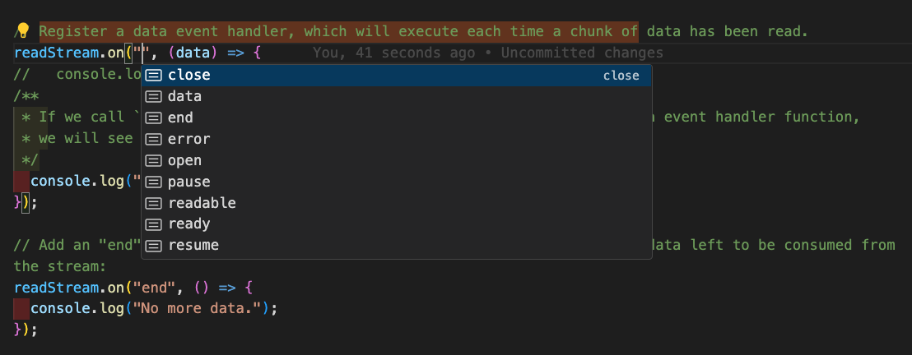
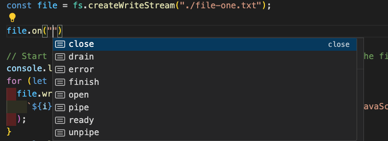

# 📖 Streams

Streams are one of the key features of Node.js. Most Node.js applications rely on the underlying Node.js `streams` implementation, be it for

- Reading/Writing files,
- Handling HTTP requests,
- Other Network communications.

Streams provide a mechanism to sequentially read input and write output.

> By reading chunks of data sequentially, we can work with vary large files(or other data input) that would generally be too large to read into memory and process as a whole.

> Streams are fundamental to big data applications or media streaming services, where the data is too large to consume at once.

## #️⃣ There are four fundamental stream types within Node.js:

1. `Readable`: streams from which data can be read (for example, `fs.createReadStream()`).
2. `Writable`: streams to which data can be written (for example, `fs.createWriteStream()`).
3. `Duplex`: streams that are both Readable and Writable (for example, `net.Socket`).
4. `Transform`: Duplex streams that can modify or transform the data as it is written and read (for example, `zlib.createDeflate()`).

**_Additionally, this module includes the utility functions `stream.pipeline()`, `stream.finished()`, `stream.Readable.from()` and `stream.addAbortSignal()`._**

## #️⃣ Creating streams in Node.js

The Node.js `stream` API is provided by the Node.js `stream` core module.

1. writable stream `fs.createWriteStream()`

`write-stream.js`

```js
const fs = require("fs");
const file = fs.createWriteStream("./file.txt");
```

2. readable stream `fs.createReadStream()`

`read-stream.js`

```js
const fs = require("fs");
const readStream = fs.createReadStream("./file-one.txt");
```

To check that the file exists, enter the following command in your Terminal:

```bash
$ ls -lh file.txt
```

`wrote` and `read` a file sequentially using the `createReadStream()` and `createWriteStream()` fs methods.

> The Node.js core `fs` module relies on the underlying Node.js `stream` core module.

> To access the node:stream module: `const stream = require('node:stream');`. The `node:stream` module is useful for creating new types of stream instances.**_ It is usually not necessary to use the `node:stream` module to consume streams._**

> **Generally, the Node.js `stream` core module is not interacted with directly.** You'd typically only interact with the Node.js `stream` implementation via higher-level APIs, such as those exposed by the `fs` module.

### Created a `writable` stream, via the `createWriteStream()` method, to sequentially `write` our file contents.

[fs.createWriteStream(path[, options])](https://nodejs.org/docs/latest-v20.x/api/fs.html#fscreatewritestreampath-options)

```bash
fs.createWriteStream(path[, options])
```

The `createWriteStream()` method accepts two `parameters`.
The first is the path of the `file` to write to, and the second is an `options` object that can be used to supply configuration to the stream.

- path `<string> | <Buffer> | <URL>`
- options `<string> | <Object>`
  - **flags**: `<string>` See support of file system flags. Default: `'w'`.
  - **encoding**: `<string>` Default: `'utf8'`
  - **fd**: `<integer> | <FileHandle>` Default: `null`
  - **mode**: `<integer>` Default: `0o666`
  - **autoClose**: `<boolean>` Default: `true`
  - **emitClose**: `<boolean>` Default: `true`
  - **start**: `<integer>`
  - **fs**: `<Object> | <null>` Default: `null`
  - **signal**: `<AbortSignal> | <null>` Default: `null`
  - **highWaterMark**: `<number>` Default: `16384`
  - **flush**: `<boolean>` If true, the underlying file descriptor is flushed prior to closing it. Default: `false`.

### Created a `readable stream` to sequentially read the contents of our file.

[fs.createReadStream(path[, options])](https://nodejs.org/docs/latest-v20.x/api/fs.html#fscreatereadstreampath-options)

```bash
fs.createReadStream(path[, options])
```

The `createReadStream()` method is an abstraction of a `readable stream`. This method expects two parameters – the first being the `path` to the contents to read, and the second an `options` object. The following table details the options we can pass to the `createReadStream()` method via an options object:

- path `<string> | <Buffer> | <URL>`
- options `<string> | <Object>`

  - **flags**: `<string>` See support of file system flags. Default: `'r'`.
  - **encoding**: `<string>` Default: `'null'`
  - **fd**: `<integer> | <FileHandle>` Default: `null`
  - **mode**: `<integer>` Default: `0o666`
  - **autoClose**: `<boolean>` Default: `true`
  - **emitClose**: `<boolean>` Default: `true`
  - **start**: `<integer>`
  - **end**: `<integer>` Default: `Infinity`
  - **highWaterMark**: `<number>` Default: `64 * 1024`
  - **fs**: `<Object> | <null>` Default: `null`
  - **signal**: `<AbortSignal> | <null>` Default: `null`

  All Node.js `streams` are instances of the `EventEmitter` class. Streams emit a series of different event.

  **_The following events are emitted on `readable streams`:_**

  

  - `close`: Emitted when the stream and any of the stream's resources have been closed. No further events will be emitted
  - `data`: Emitted when new data is read from the stream
  - `end`: Emitted when all available data has been read
  - `error`: Emitted when the readable stream experiences an error
  - `open`: --
  - `pause`: Emitted when the readable stream is paused
  - `readable`: Emitted when there is data available to be read
  - `ready`: ---
  - `resume`: Emitted when a readable stream resumes after being in a paused state

  **_The following are the events emitted on `writable streams`_**

  

- `close`: Emitted when the stream and any of the stream's resources have been closed. No further events will be emitted
- `drain`: Emitted when the writable stream can resume writing data
- `error`: Emitted when the writeable stream experiences an error
- `finish`: Emitted when the writeable stream has ended and all writes have completed
- `open`: ---
- `pipe`: Emitted when the stream.pipe() method is called on a readable stream
- `ready`: ---
- `unpipe`: Emitted when the stream.unpipe() method is called on a readable stream


## #️⃣  Dive deeper into `readable streams`.

- How to read from `infinite` data sources.
- How to use the more modern `asynchronous` iterator syntax with `readable streams`.

### Interacting with `infinite` data. 

Streams make it possible to interact with `infinite` amounts of data.
