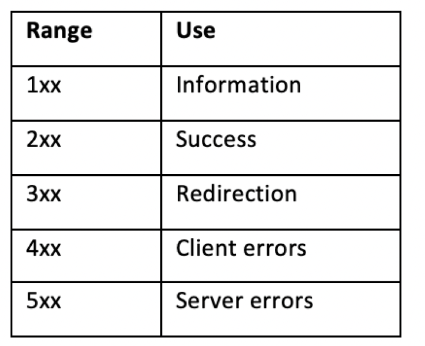
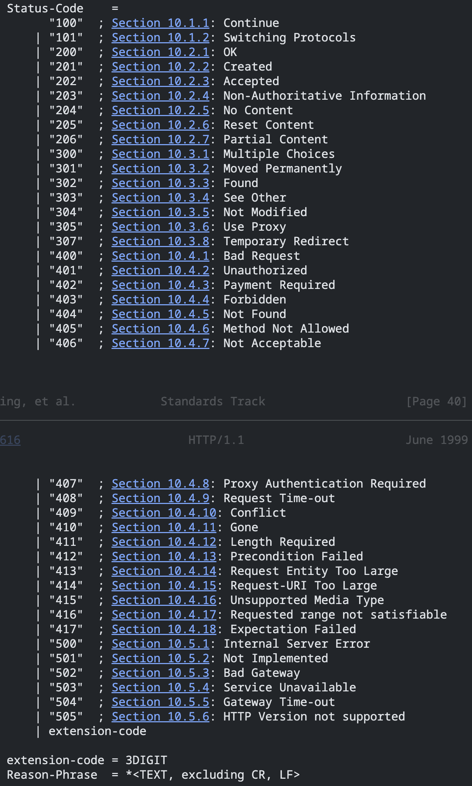

# Web Protocols

Node.js was built with web servers in mind.

application programming interfaces (APIs)
HyperText Transfer Protocol (HTTP)

It's important to have an understanding of how Node.js interacts with underlying `web protocols`, as these `web protocols` and fundamental concepts form the basis of most real-world web applications. Later,

Will cover the following:

- Using `http module` to make `HTTP` requests
- Building an `HTTP server` to accept `GET requests`
- Handling `HTTP` `POST requests`
- Using formidable to handle `file uploads`
- Using ws to create a `WebSocket` server
- Sending an automated `email` using your own `SMTP` server

📒 `HTTP`: is a `stateless protocol` that was originally designed to facilitate communication between `web browsers` and `servers`.

## #️⃣ Using http module to make HTTP requests

To build `HTTP servers`, the Node.js core `http` and `https` modules expose APIs that can be used to send requests to other servers.

To use the `Node.js` core `http` and `https` modules to send both an `HTTP` `GET request` and an `HTTP` `POST request`.

📒 **_Important note_** : Postman `(http://postman.com)` is a platform for API development and provides a representational state transfer (REST) client app that you can download to use to send HTTP requests. Postman also provides a service named Postman Echo—this provides an endpoint that you can send your HTTP requests to for testing. Refer to the Postman Echo documentation at: [Link](https://www.postman.com/postman/workspace/published-postman-templates/documentation/631643-f695cab7-6878-eb55-7943-ad88e1ccfd65?ctx=documentation)

We leveraged the Node.js core `http` module to send `HTTP GET` and `HTTP POST` requests.

**_The Node.js core `http module` relies on the underlying Node.js core `net module`._**

### 📝 For the HTTP GET request, we call the http.get() function with two parameters:

```js
http.get("http://example.com", (res) => res.pipe(process.stdout));
```

- The first parameter is the endpoint that we wish to send the request to,
- The second is the callback function. The callback function executes once the HTTP GET request is complete.

### 📝 To make the HTTP POST request, we use the http.request() function.

This function also takes two parameters

```js
const payload = `{"test": "value"}`;
const hostname = "postman-echo.com";
const options = {
  method: "POST",
  hostname,
  path: "/post",
  headers: {
    "Content-Type": "application/json",
    "Content-Length": Buffer.byteLength(payload),
  },
};

// To send the HTTP POST request.
const postRequest = http.request(options, (res) => {
  // write the responses of HTTP status code
  process.stdout.write(`Status Code: ${res.statusCode} \n`);

  // body to STDOUT once the response is received
  process.stdout.write("Body: ");
  // Forwards the request's response to STDOUT
  res.pipe(process.stdout);
});

// catch any errors that occur on the request
postRequest.on("error", (err) => console.error("Error: ", err));
// To send our request with the payload
postRequest.end(payload);
```

- The first parameter to the `request()` function is the options object. we used the options object to configure:
  - Which HTTP method to use. `method: "POST",`
  - the hostname. `const hostname = "postman-echo.com";`
  - the path the request should be sent to, `path: "/post",`
  - the headers to be set on the request. `headers: { ... },`
- The second parameter to the `request()` function is the callback function to be executed upon completion of the HTTP POST request.

### 📝 how to send requests over HTTPS.

`HTTPS` stands for `HyperText Transfer Protocol Secure`. `HTTPS` is an extension of the HTTP protocol.
Communications over `HTTPS` are `encrypted`. Node.js core provides an `https module`, alongside the `http module`, to be used when dealing with `HTTPS` communications.

```js
const https = require("https");

https.get(...);
https.request(...);
```

## #️⃣ Building an HTTP server to accept GET requests

`HTTP` stands for `HyperText Transfer Protocol` and is an application layer protocol that underpins the `World Wide Web` (WWW). `HTTP` enables communication between `servers` and `browsers`.

📒 **_Important note_**: When building large complex applications, it is typical to implement these using a higher-level `framework` rather than interacting with core `Node.js APIs`.

```js
const http = require("http");

const HOSTNAME = process.env.HOSTNAME || "0.0.0.0";
const POST = process.env.POST || 3000;

// Create a local server to receive data from
const server = http.createServer((req, res) => {
  res.writeHead(200, { "Content-Type": "application/json" });
  res.end(
    JSON.stringify({
      data: "Hello World!",
    })
  );
});

server.listen(POST, HOSTNAME, () => {
  console.log(`Server listening on port ${server.address().port}`);
});
```

The Node.js core `http module` provides interfaces to the features of the HTTP protocol.

Created a server using the `createServer()` function that is exposed by the `http module`.
the `createServer()` function a `request listener` function that is executed upon each `request`.

Each time a request is received to the specified route, the request listener function will execute. The request listener function has two parameters, `req` and `res`, where

- `req` is the request object.
- `res` is the response object.

The `http module` creates the `req` object based on the data in the request. The `createServer()` function returns an `http.Server` object. We start the server by calling the `listen()` function.
By pass the listen() our `HOSTNAME` and `PORT` parameters to instruct the server which hostname and port it should be listening on.

> Uniform Resource Locator (URL),

### 📝 HTTP status codes are part of the HTTP protocol

The following table shows how the HTTP response codes are grouped

- 1xx: Informational - Request received, continuing process

- 2xx: Success - The action was successfully received, understood, and accepted

- 3xx: Redirection - Further action must be taken in order to complete the request

- 4xx: Client Error - The request contains bad syntax or cannot be fulfilled

- 5xx: Server Error - The server failed to fulfill an apparently valid request


The individual values of the numeric status codes defined for HTTP/1.1, and an example set of corresponding Reason-Phrase's, are presented below.


The http module exposes a constant object that stores all of the HTTP response codes and their corresponding descriptions `http.STATUS_CODES`.

You may not want to predefine the `port` that your server binds to. It's possible to bind your HTTP server to a random free `port`. We defined a constant for the `HOSTNAME` and `PORT` values with the following lines:

```js
const HOSTNAME = process.env.HOSTNAME || "0.0.0.0";
const PORT = process.env.PORT || 3000;
```

It's a good practice to allow the `HOSTNAME` and `PORT` values to be set via `environment` variables as this allows deployment `orchestrators`, such as `Kubernetes`, to inject these values at `runtime`.

It is also possible to instruct your server to bind to a random free port. To do this, we set the PORT value to 0.

```js
const PORT = process.env.PORT || 0;
```

## #️⃣ Handling HTTP POST requests

The HTTP POST method is used to send data to the server.

A `POST` request typically contains data within the **_body of the request_**, which is sent to the server to be handled. The submission of a `web form` is typically done via an `HTTP POST request`.

📒 **_Important note_**: Node.js, provides `asynchronous` interaction with `HTTP` data at a lower level, which allows us to interface with the `incoming message` body as a `stream`.

The Node.js core `http` module is built on top of, and interacts with, the Node.js core `net` module.

The `net` module interacts with an underlying `C` library built into Node.js, called `libuv`. The `libuv` `C` library handles network socket **`input/output (I/O)`** and also handles the passing of data between the `C` and `JavaScript` layers.

When the server receives an `HTTP request`, the `http` module will create objects representing the `HTTP request` (req) and the `HTTP response` (res). After this, our request handler is called with the `req` and `res` arguments.

## #️⃣ Using formidable to handle file uploads

Uploading a file to the web is a common `activity`, be it an `image`, a `video`, or a `document`.
Files require different handling compared to simple `POST` data. Browsers `embed` files being uploaded into `multipart messages`.

Multipart messages allow multiple pieces of content to be combined into one payload. To handle multipart messages, we need to use a multipart parser.