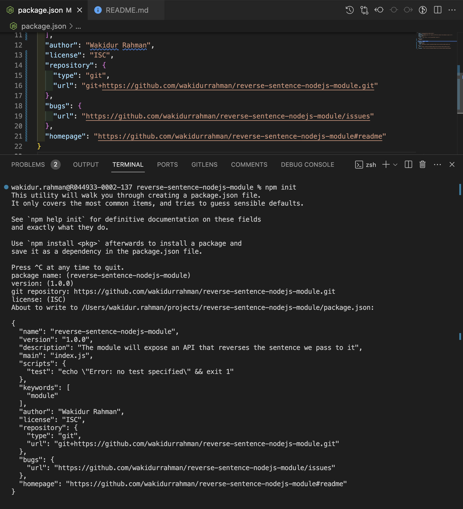
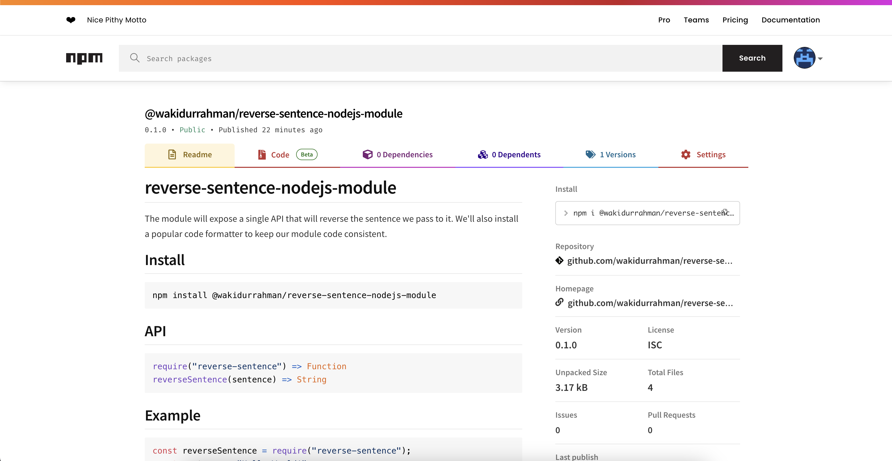

# Developing NodeJS Modules

Node.js modules are `libraries` or a `set of functions` we want to include in our application. Most modules will provide an API to expose their functionality.
The `npm` registry is where most Node.js modules are stored, where there are over a `million` Node.js modules available.

📒 **_Important note_** : It is recommended to install Node.js with **Node Version Manager (nvm)**. It is a tool that enables you to easily switch Node.js versions on most Unix-like platforms.

📒 **_Important note_** : `npm` is the name of the Command-Line Interface tool (CLI) bundled with Node.js as the default package manager.

📒 **_Important note_** : `Yarn` is a popular alternative package manager for JavaScript and was created as an alternative to the npm CLI in 2016.

## #️⃣ Consuming Node.js modules

We are going to learn how to consume npm modules from the public `npm` registry using the `npm` **CLI**.

To install the `express module`, type the following command while in your project directory:

`$ npm install express`

After this command run.

- ➡️ The module has been added to a `dependencies` field inside `package.json` file.

```js
{
    "dependencies": {
        "express": "^4.17.1"
    }
}
```

- ➡️ Both a `node_modules` directory and a `package-lock.json` file have now been created inside project directory.

> We used of both `npm` the `command-line interface` bundled with Node.js, and The `npm public registry` to download the third-party module.

The first command was `$ npm init`. This command initializes a new project in the current working directory.

Using `npm init` to Initialize a Project.

### 📝 [The Basics: Getting started with npm](https://nodesource.com/blog/the-basics-getting-started-with-npm/)

Today, `npm` is a cornerstone of modern web development, whether used exclusively with Node.js as a package manager or as a build tool for the front end.

1. The Essential npm Commands

   - Using `npm init` to initialize a project
   - Using `npm init --yes` to instantly initialize a project
   - Install modules with `npm install`
   - Install modules and save them to your `package.json` as a dependency
   - Install modules and save them to your `package.json` as a developer dependency
   - Install modules globally on your system

2. The Basics of package.json

   2.1. Identifying Metadata Inside package.json

   - The `name` property
   - The `version` property
   - The `license` property
   - The `description` property
   - The `keywords` property

     2.2. functional metadata inside package.json

   - The `main` property
   - The `repository` property
   - The `script` property
   - The `dependencies` property
   - The `devDependencies` property

3. Understanding the different types of dependencies and other host Specs inside package.json

- PeerDependencies
- PeerDependenciesMeta
- OptionalDependencies
- BundledDependencies
- engines
- os
- cpu

**_The Essential npm Commands_**

When using npm, you're most likely using the command-line tool for most of your interactions.

The `npm init` command is a step-by-step tool to build out the scaffolding for your project. It will prompt for input on a few aspects in the following order:

1. `name:` Defaults to the containing directory name.
2. `initial version:` 1.0.0 by default.
3. `description:` An overview of what it is and why you're doing the project.
4. `entry point:` Meaning the `main` file is to be executed when run.
5. `test command:` To trigger testing with something like Standard.
6. `git repository:` Where the source code can be found.
7. `keywords:` Tags related to the project.
8. `license:` This defaults to ISC. Most open-source Node.js projects are MIT.

> **The only properties that are mandatory are the package `name` and `version`.**

It's worth noting that if you're content with the suggestion that the `npm init` command provides next to the prompt, you can hit or keys to accept it and move on to the following prompt.

Once you run through the `npm init` steps above, a `package.json` file will be generated and placed in the current directory.

```bash
$ npm init # This will trigger the initialization
```

```bash
$ npm init --yes # This will trigger automatically populated initialization
```

````bash
$ npm install <module>

$ npm install <module> # Where <module> is the name of the module  you want to install
$ npm i <module> # Where <module> is the name of the module you  want to install - using the i alias for installation

$ npm install <module> --save # Where <module> is the name of the  module you want to install - Kept for compatibility
$ npm install <module> --no-save # Where <module> is the name of the  module you want to install - To avoid adding it as a dependency

$ npm install <module> --save-dev # Where <module> is the name of  the  module you want to install

$ npm install <module> --global # Where <module> is the name of  the module you want to install globally```
$ npm install <module> -g # Where <module> is the name of the  module you want to install globally, using the -g alias
````

```bash
$ npm install express
```

It is also possible to configure default answers using the `npm config` command.

```bash
$ npm config set init.author.name "Your Name"
```

📒 **_Important note_** : By default, when passed a name, the npm install command will look for a module with that name and download it from the public npm registry. But it is also possible to pass the `npm install` command other parameters, such as a `GitHub URL`, and the command will install the content of the `URL`.

When the `install` command completes, it will put the module contents into a
`node_modules` directory.

> If you look at the contents of the `node_modules` directory, We will notice that more than just the `express` module is present. This is because `express` has its own `dependencies`, and their `dependencies` may also have their own `dependencies`.

When installing a `module`, we're potentially installing a whole tree of modules.

Use the `$ npm list` command to list the contents of your `node_modules` directory.
`$ npm list`

The following output shows the structure of a node_modules directory
`$ ls node_modules`

> `package-lock.json` files were introduced in `npm` version `5`.

The difference between `package-lock.json` and `package.json` is that a `package-lock` file defines the specific versions of all of the modules in the `node_modules` tree.

It is possible that two `developers` with the same `package.json` files may experience different results when running `$ npm install`. This is mainly due to the fact that a `package.json` file can specify **acceptable module ranges**.

For example, we installed the latest version of express, and this resulted in the following range:

```js
{
  ...,
  "dependencies": {
    "express": "^4.18.2"
  }
}
```

`^ ` indicates that it will allow all versions above👆 `v4.18.2` to be installed, but not v5.x.x.

If `v4.18.3` was to be released in the time between when developer `A` and developer `B` run the
`npm install` command, then it is likely that developer `A` will get version 👉 `v4.18.2` and
developer `B` will get version 👉 `v4.18.3`.

If the `package-lock.json` file is **shared between the developers**, they will be guaranteed the installation of the same `version` of `express` and the same versions of all of the `dependencies` of `express`.

Imported the `express` module to test whether it was accessible inside `require-express.js` file.

```js
const express = require("express");
```

📒 **_Note_** : that this is the same way in which we `import` Node.js `core` modules like `fs`, `http`, `path`. The module loading algorithm will first check to see whether you're requiring a core `Node.js` module; it will then look in the `node_modules` folder to find the `module` with that name.

It is also possible to require specific files by passing a relative path, such as the following:

```JS
const file = require("./file.js");
```

### 📝 Development dependencies

`Development dependencies` (`devDependencies`) are typically used for tooling that supports you in developing your application.

`Development dependencies` should not be required to run your application.

Having a distinction between `dependencies`(`"dependencies": {...}`) that are required for your application to run and `dependencies` that are required to `develop` your application is particularly useful when it comes to `deploying` your application.

Your `production` application `deployment` can omit the `development dependencies` (`"devDependencies": { "prettier": "2.0.5" }`), which makes the resulting `production` application much **smaller**. Smaller deployments reduce the cost of deployment.

A very common use of `development dependencies` is for `linters` and `formatters`.
`prettier` is a tool that reformats your code consistently. For a much more customizable linter, you should consider using `eslint`.

to install prettier, we can use the following

```bash
$ npm install --save-dev --save-exact prettier
```

- To install a development dependency, you need to supply the install command with the `--save-dev` parameter.
- `--save-exact` pins the exact version in your package.json file. This is recommended when using `prettier` as `patch` `releases` may introduce new style `rules`, which when automatically picked up, could be `troublesome`.

### 📝 Global modules

Typically, the type of modules you'll install globally are binaries or a program that you want to be accessible in your shell. To globally install a module, you pass the --global command to the install command as follows:

````bash

$ npm install <module> --global # Where <module> is the name of  the module you want to install globally```
$ npm install <module> -g # Where <module> is the name of the  module you want to install globally, using the -g alias

$ sudo npm install -g typescript
````

This will not install typescript into your `node_module` folder. Instead, it will be installed into the `bin` directory of your `Node.js` `installation`.

In `npm` version v5.2, `npm` added the `npx` command to their CLI. This command allows you to execute a global module without having it **permanently** stored.

```bash
$ npx lolcatjs
```

In general, `npx` should be sufficient for most modules that you wish to execute. However, if you want the global module to be `permanently` available `offline`, then you may wish to still globally install the module rather than using the `npx` command.

### 📝 Responsibly consuming modules

There are many considerations you should take when choosing a Node.js module to include in your application. The following few considerations should be taken in particular:

1. `Security` : Can you depend on the module to fix security vulnerabilities?
2. `Licenses` : If you link with open source libraries and then distribute the software, your software needs to be compliant with the licenses of the linked libraries. Licenses can vary from restrictive/protective to permissive.
3. `Maintenance`: You'll also need to consider how well maintained the module is. The majority of modules publish their source code to GitHub and have their `bug reports` viewable as GitHub `issues`. From viewing their `issues` and **how/when** the maintainers are responding to `bug reports`, you should be able to get some insight into how maintained the module is.

## #️⃣ Setting up your own module

For our own module,

- 👉 Will set up a typical file
- 👉 Directory structure for our module
- 👉 Learn how to initialize our project with the npm CLI.
- 👉 Create a GitHub repository to store our module code.

The module we're going to make : ➡️ **👁️ will expose an API that reverses the sentence we pass to it**.

To make a new directory for our module we will require to have

1. GitHub account `https://github.com/wakidurrahman`
2. npm account `https://www.npmjs.com/~wakidurrahman`

Process of creating a Module

- Using the `npm` CLI to initialize our `reverse-sentence-nodejs-module` module `$ npm init --yes`
- Create a GitHub repository to store our module code. 📒 **_Note_** : that the repository name does not have to match the module name.
- Recommended to add the default `.gitignore` for Node.js
- GitHub remote repository for the repository field. This will update our package.json file's repository field to the following
  

It was then possible to reinitialize our module by re-running the `$ npm init` command.

### 📝 semver (semantic versioning)

we specified the module version as `v0.1.0` to adhere to semantic versioning.

Semantic version, often abbreviated to `semver`, is a well-known standard for versioning.
The NodeJS release schedule is based on the [`Semantic Versioning`](https://semver.org/) standard.
Node.js itself tries to adhere to semantic versioning as much as possible.

Given a version number `MAJOR`.`MINOR`.`PATCH`, increment the:

1. `MAJOR` version when you **make incompatible API changes**
2. `MINOR` version when you **add functionality in a backward compatible manner**
3. `PATCH` version when you **make backward compatible bug fixes**

Additional labels for pre-release and build metadata are available as extensions to the `MAJOR`.`MINOR`.`PATCH` format.

Semantic version numbers are in the form of X.Y.Z:

1. X represents the `major` version.
2. Y represents the `minor` version.
3. Z represents the `patch` version.

Semantic Versioning states that you increment

> The `major` version, the first value, when you make breaking API changes.

> The second number, the minor version, is incremented when new features have been added in a backward-compatible (or non-breaking) manner.

> The patch version, or the third number, is for bug fixes and non-breaking and non-additive updates.

```js
"version": "0.1.0",
```

The `major` `version` `0` is reserved for initial development and it is acceptable to make breaking changes up until `v1` is released.

## #️⃣ Implementing your module

The module will expose a single API that will reverse the sentence we pass to it. We'll also install a popular code formatter to keep our module code consistent.

```js
"use strict";

/**
 * To reverse the sentence.
 * @param {*} sentence : expect string
 * @returns
 */

function reverseSentence(sentence) {
  // to split the sentence into an array of single-word strings
  const wordsArray = sentence.split(" ");

  // to reverse the array
  const reversedArray = wordsArray.reverse();

  // to join the elements of the array back together to reform the sentence as a string.
  const reversedSentence = reversedArray.join(" ");

  return reversedSentence;
}

module.exports = reverseSentence;
```

`module.exports` is an object that is accessible in all `Node.js JavaScript` by default. Whatever is assigned to the `module.exports` object is `exposed`.

```bash
$ node --print "require('./')('Hello Beth\!')"
```

We tested our module by passing the `--print` argument to the Node.js process. The `–print` flag evaluates the statement or expression supplied and outputs the result.

First authenticated our local npm client using the `$ npm login` command. provides the ability to set up access controls so that certain users can publish to specific modules or scopes.

`$ npm login` identifies who you are and where you're entitled to publish. It is also possible to log out using `$ npm logout`.
you can authorize your npm client `npm login` but it is depend on below `.npmrc` set npm configuration variables, such as credentials, registry location
.npmrc file to use for reference:

```sh
registry=https://registry.npmjs.com/
email=example@mail.com
always-auth=true
//registry.npmjs.com/:_auth=npm_432112dfdkk

```

It is ideal to keep your public GitHub repository up to date. Typically, module authors will create a `"tag"` on GitHub that matches the version that is pushed to `npm`.
This can act as an audit trail for users wishing to see the source code of the module at a particular version, without having to download it via npm.

However, please 📒 **_note_** : that nothing is enforcing a rule that the code you publish to npm has to match the code you publish to GitHub:

```sh

$ git add .
$ git commit -m "v0.1.0"
$ git push origin master
$ git tag v0.1.0
$ git push origin v0.1.0
```

### ♨️ 📢 💪 To publish our module to the npm registry using the following command:

```sh
$ npm publish --access=public
```
The command that did the actual publishing to the registry was the following:


publish was successful by navigating to 
https://www.npmjs.com/package/@wakidurrahman/reverse-sentence-nodejs-module Expect to see
the following information about your module:
