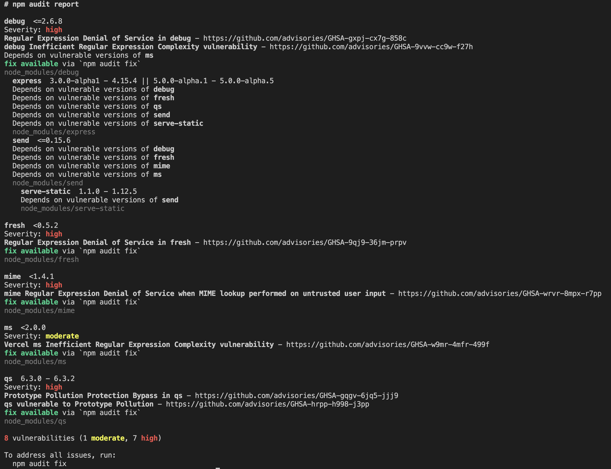

# 💁‍♂️ Securing NodeJS Application.

As with all software, you must take certain precautions to ensure the application you're building is secure.

- Cross-Site Scripting (XSS)
- Cross-Site Request Forgery (CSRF) .
- Denial of Service (DoS)
- SQL injection attacks
- security-related headers on our HTTP requests
- implement an authentication layer
- parameter pollution attacks
- injection attacks

## #️⃣ Detecting known dependency vulnerabilities

This ecosystem is key to Node.js's success. But it does lead to large, nested dependency trees within our applications.

Not only must we be concerned with the security of the application code that we write ourselves, but we must also consider the security of the code included in the modules in our dependency tree.

### 📝 `vulnerabilities`

We've intentionally chosen an old version with known `vulnerabilities` to demonstrate how to audit our dependencies. This version of `Express.js` is not recommended for use in production applications:

```sh
$ npm i express@4.15.0

added 46 packages, and audited 47 packages in 1s

8 vulnerabilities (1 moderate, 7 high)

To address all issues, run:
  npm audit fix --force

Run `npm audit` for details.
```

Observe that the npm output detects nine known `vulnerabilities` in this version of `Express.js`.

### 📝 `$ npm audit`

Run the `$ npm audit` command for more details:

```sh
$ npm audit

```



### 📝 `$ npm audit fix`

We can try to automatically fix the vulnerabilities by using the `$ npm audit fix` command.

```sh
$ npm audit fix

// or
$ npm audit fix --force
```

`$ npm audit` to scan for known `vulnerabilities` in our dependencies.

> [!TIP]
> The `$ npm audit` command has been available since npm version 6. The command submits a report of the dependencies in our application and compares it with a database of known vulnerabilities.

- 👉The `$ npm audit` command will `audit` `direct`, `development`, `bundled`, and `optional dependencies`.
- 👉The command requires both a `package.json` and a `package-lock.json` file to be present; otherwise, it will fail.
- 👉 The audit automatically runs when a package is installed with the $ npm install command.

> [!NOTE]
> Many organizations consider `$ npm audit` a precautionary measure to protect their applications against known security `vulnerabilities`. For this reason, it is common to add the `$ npm audit` command to your **Continuous Integration (CI)** testing. The `$ npm audit` command reports an error code of `1` when a `vulnerability` is `found`; this error code can be leveraged to indicate a `failed` `test`.

> [!TIP]
> It is possible to override this behavior and force `npm` to update all dependencies, even if they include breaking changes, using the `$ npm audit fix --force` command.

## #️⃣ Authentication with Express.js

Many web applications require a `login` system. Users of a website have different privileges, and to identify which resources they're able to access, they must first be identified via authentication.

The `express-session` module and explained how we can use it to build a simple login functionality.

```js
const session = require("express-session");
// Register the express-session middleware.
app.use(
  session({
    name: "SESSIONID",
    secret: "keyboard cat",
    resave: false,
    saveUninitialized: false,
    // cookie: { secure: true },
  })
);
```

This middleware injects a `session` object into every request object (`req`). Before the user is authenticated, the session value will be an `empty` object.

- `name`: The name of the cookie for the session.
- `secret`: The secret used to sign the session cookie. This is a required configuration option.
- `resave`: Forces the session to be resaved back in the session store, which is where the session information is stored. In the recipe, this value was set to false, indicating that we do not wish to save the session data in the session store.
- `saveUninitialized`: Forces unsaved sessions to be saved to the session store.

### 📝 Secure session cookies

Session cookies can be marked with a `Secure` attribute. The Secure attribute forces the browser to not use HTTP to send cookies back to the server.

It's typical for a `production` environment to apply the `SSL` encryption at the load balancer layer.

A `load balancer` is a technology in an application architecture that is responsible for boosting the efficiency of the application by distributing a set of tasks over a set of resources – for example, distributing login requests to servers.

### 📝 Hashing with bcrypt

Passwords should never be stored in plain text and should instead be stored in a hashed form. Passwords are transformed into a hashed form using a hashing function. Hashing functions use an algorithm to transform a value into unrecognizable data.

Hashing is typically combined with a technique called `salting`. Salting is where a unique value, referred to as the `salt`, is appended to the password before the hash is generated.

This helps to protect against `brute-force` attacks and makes it more difficult to `crack` the password.

bcrypt (https://www.npmjs.com/package/bcrypt) is a popular module that is used to hash passwords in Node.js.

`$ npm i bcrypt`

## #️⃣ Setting HTTP headers with Helmet

One of the precautionary measures we can take is to set certain security-related HTTP headers on requests.
Sometimes, this is referred to as `"hardening"` the headers of our HTTP requests.

The `Helmet` module (https://github.com/helmetjs/helmet) provides a middleware to set security-related headers on our `HTTP requests`, saving time on manual configuration.

```js
// server.js
const express = require("express");

const app = express();

app.get("/", (req, res) => res.send("Hello World!"));
app.listen(3000, () => {
  console.log("Server listening on port 3000");
});
```

- 👉 First start the web server

```sh
$ node server.js
```

- 👉 inspect the headers that our Express.js application returns. We can do this using the cURL tool.

```sh
$ curl -I http://localhost:3000

output 👇👇👇

HTTP/1.1 200 OK
X-Powered-By: Express
Content-Type: text/html; charset=utf-8
Content-Length: 12
ETag: W/"c-Lve95gjOVATpfV8EL5X4nxwjKHE"
Date: Wed, 31 Jan 2024 07:47:09 GMT
Connection: keep-alive
Keep-Alive: timeout=5
```

> [!NOTE]
> The `X-Powered-By: Express` header.

let's start hardening these headers with the helmet module.

```js
app.use(helmet());
```

```sh
$ curl -I http://localhost:3000

output 👇👇👇

HTTP/1.1 200 OK
Content-Security-Policy:
    default-src 'self';
    base-uri 'self';
    font-src 'self' https: data:;
    form-action 'self';
    frame-ancestors 'self';
    img-src 'self' data:;
    object-src 'none';
    script-src 'self';
    script-src-attr 'none';
    style-src 'self' https: 'unsafe-inline';
    upgrade-insecure-requests
Cross-Origin-Opener-Policy: same-origin
Cross-Origin-Resource-Policy: same-origin
Origin-Agent-Cluster: ?1
Referrer-Policy: no-referrer
Strict-Transport-Security: max-age=15552000; includeSubDomains
X-Content-Type-Options: nosniff
X-DNS-Prefetch-Control: off
X-Download-Options: noopen
X-Frame-Options: SAMEORIGIN
X-Permitted-Cross-Domain-Policies: none
X-XSS-Protection: 0
Content-Type: text/html; charset=utf-8
Content-Length: 12
ETag: W/"c-Lve95gjOVATpfV8EL5X4nxwjKHE"
Date: Wed, 31 Jan 2024 07:50:48 GMT
Connection: keep-alive
Keep-Alive: timeout=5
```

> [!NOTE]
> The X-Powered-By header has been removed.

The `helmet` module configures some of the HTTP headers on our requests based on its `secure` defaults.

`helmet` removes the `X-Powered-By: Express` header so that discovering the server is Express-based becomes more difficult.
The reason to obfuscate this is to protect against attackers trying to exploit `Express.js-oriented` security vulnerabilities, slowing them down in determining the type of server being used in the application.

The `helmet` module sets the injected HTTP headers to sensible secure defaults.

The `helmet` middleware simply modifies the `response` `headers` to appropriate defaults.
To demonstrate what `helmet` is doing under the covers, we can try `injecting` the same `HTTP headers` using the Node.js core `http` module:

## #️⃣ Protecting against HTTP parameter pollution attacks

One of the easiest of vulnerabilities to exploit is **injection attacks**, with **SQL injection attacks** being the most common.

> [!IMPORTANT]
> SQL injection attacks are where an attacker injects malicious SQL into an application to delete, distort, or expose data stored in the database.

> [!NOTE]
> If an application accepts `input` in any `form`, you need to take necessary precautions to ensure that `malicious` `inputs` cannot exploit your application.

Parameter pollution is a type of **injection attack** where the `HTTP parameters` of a web application's `HTTP endpoints` are injected with specific malicious input.

HTTP parameter pollution can be used to expose `internal data` or ever cause a **_Denial of Service(DoS)_** attack, where an attacker tries to interrupt a resource and render it inaccessible by the resource's intended users.

We can protect an HTTP server against `parameter pollution attacks`. Parameter pollution attacks are where malicious input is injected into
URL parameters.

We can do this using the cURL tool.

```sh
$ curl -I http://localhost:3000

$ curl http://localhost:3000/\?msg\=hello
```

Server

```js
const app = express();

/**
 * the asyncWork() function is for demonstrational purposes only.
 * In a real application, we could expect some asynchronous task to happen, such as a query to be made to a database or external service.
 * @param {*} callback
 */
const asyncWork = (callback) => {
  setTimeout(callback, 0);
};

app.get("/", (req, res) => {
  console.log("request", req.query);
  asyncWork(() => {
    const upper = (req.query.msg || "").toUpperCase();
    res.send(upper);
  });
});

app.listen(PORT, HOSTNAME, () => {
  console.log("Server listening on port 3000");
});
```

```sh
$ curl http://localhost:3000/\?msg\=hello\&msg\=world

output 👇👇👇

 const upper = (req.query.msg || "").toUpperCase();
                                        ^

TypeError: (req.query.msg || "").toUpperCase is not a function
    at Timeout._onTimeout (/Users/xx/projects/advanced-node-js/docs/books/node-book-fourth-edition/exercises/ch9/express-input/server.js:26:41)
    at listOnTimeout (node:internal/timers:573:17)
    at process.processTimers (node:internal/timers:514:7)

Node.js v20.11.0
Failed running 'server.js'

```

So, it is possible to cause the server to `crash` just by sending `duplicate` `parameters`. This makes it `fairly` easy for a perpetrator to launch an effective`DoS`attack.

### 📝 Injection attacks

Injection attacks are made possible when inputs are not appropriately sanitized.

> [!NOTE]
> Express.js depends on the `qs` module for URL parameter handling.

The `qs` module's approach to handling multiple parameters of the same name is to convert the duplicate names into an array. like `{ msg: [ 'hello', 'world' ] }`

> [!IMPORTANT]
> Other than enabling `DoS-style` `attacks`, not `sanitizing` and `validating` input `parameters` can lead to `XSS attacks`.

### 📝 Node.js Buffer objects can be exploited by attackers.

Node.js `Buffer` objects can be exploited by attackers if used incorrectly in application code.

> [!NOTE] > `Buffer` objects represent a fixed-length series of `bytes` and are a subclass of JavaScript's Uint8Array() class.

In many cases, we'll be interacting with `Buffer` objects via `higher-level` APIs, such as using `fs.readFile()` to read files.

However, in cases where you need to interact with `binary` data directly, you may use `Buffer` objects, as they provide `low-level` fine-grained APIs for `data` manipulation.

Node REPL(Read Eval Print Loop)

```sh

$ node
Welcome to Node.js v20.11.0.
Type ".help" for more information.

> new Buffer(10)
<Buffer 00 00 00 00 00 00 00 00 00 00>
> (node:6810) [DEP0005] DeprecationWarning: Buffer() is deprecated due to security and usability issues. Please use the Buffer.alloc(), Buffer.allocUnsafe(), or Buffer.from() methods instead.
(Use `node --trace-deprecation ...` to show where the warning was created)
```

> [!IMPORTANT]
> DeprecationWarning: Buffer() is deprecated due to security and usability issues.

> [!TIP]
> Please use the `Buffer.alloc()`, `Buffer.allocUnsafe()`, or `Buffer.from()` methods instead.

REPL

```sh

> let greeting = { "msg": "hello"}
undefined
> greeting
{ msg: 'hello' }
> new Buffer(greeting.msg)
<Buffer 68 65 6c 6c 6f>
> greeting = {"msg": 10}
{ msg: 10 }
> greeting.msg
10
> new Buffer(greeting.msg)
<Buffer 00 00 00 00 00 00 00 00 00 00>
> greeting = {"msg": 108382738238728372837287382732080283028302830280382333}
{ msg: 1.0838273823872837e+53 }
> new Buffer(greeting.msg)
Uncaught:
RangeError [ERR_OUT_OF_RANGE]: The value of "size" is out of range. It must be >= 0 && <= 4294967296. Received 1_.08_382_738_238_728_37e_+53
    at validateNumber (node:internal/validators:181:11)
    at __node_internal_ (node:buffer:393:3)
    at Function.alloc (node:buffer:401:3)
    at new Buffer (node:buffer:277:19) {
  code: 'ERR_OUT_OF_RANGE'
}
>

```

This has created a `Buffer` object of size `10`. So, an attacker could pass any value via the `msg` property and a `Buffer` object of that size would be created.

A simple DoS attack could be launched by the attacker by supplying large integer values on each request.👇👇👇

```sh

> greeting = {"msg": 108382738238728372837287382732080283028302830280382333}
{ msg: 1.0838273823872837e+53 }
> new Buffer(greeting.msg)
Uncaught:
RangeError [ERR_OUT_OF_RANGE]: The value of "size" is out of range. It must be >= 0 && <= 4294967296. Received 1_.08_382_738_238_728_37e_+53
    at validateNumber (node:internal/validators:181:11)
    at __node_internal_ (node:buffer:393:3)
    at Function.alloc (node:buffer:401:3)
    at new Buffer (node:buffer:277:19) {
  code: 'ERR_OUT_OF_RANGE'
}
```

**👉 Recommends using**

- new Buffer.from()
- new Buffer.alloc(10)
- new Buffer.allocUnsafe(10)

```sh
> greeting = {"msg": 10}
> new Buffer.alloc(greeting.msg)
<Buffer 00 00 00 00 00 00 00 00 00 00>
```

## #️⃣ Preventing JSON pollution

In a `JSON pollution` attack, an attacker leverages this ability to override built-in attributes and functions with malicious code.

Applications that accept `JSON` as `user input` are the most able/capable to these attacks. In the most `severe` cases, it's possible to `crash` a `server` by just supplying additional values in `JSON input`.

> [!WARNING]
> This can make the server vulnerable to `DoS` attacks via `JSON pollution`.

> [!TIP]
> The key to preventing `JSON pollution` attacks is to `validate` all `JSON input`. This can be done `manually` or by defining a `schema` for your `JSON` to `validate` against.

## #️⃣ Preventing cross-site scripting(XSS) attacks

XSS attacks are client-side injection attacks where malicious are injected into websites.

XSS vulnerabilities are vary dangerous, as they can compromise

```sh
$ npm install he
```

Route handler

```js
app.get("/", (req, res) => {
  const { previous, lang, token } = req.query;
  getServiceStatus((status) => {
    const href = he.encode(`${previous}${token}/${lang}`);
    res.send(`
        <h1>Service Status</h1>
        <div id=status>
        ${status}
        </div>
        <div>
        <a href="${href}">Back</a>
        </div>
        `);
  });
});
```

We've used the he module to prevent an XSS attack.

We fixed this vulnerability using the `he module`. We use the he module's `encode()` function. This function accepts text that is expected to be `HTML` or `XML` input and returns it in `escaped` form.

`XSS` attacks are `client-side` injection attacks where malicious `scripts` are injecting into trusted websites. The general flow of an `XSS` attack is as follows:

1. ♨️ Malicious input enters the application – typically via a web request.
2. ♨️ The input is `rendered` as `dynamic` content on the web page because the input has not been appropriately sanitized.

### 📝 The two main types of XSS attacks are

1. persistent XSS
2. reflected XSS.

**Persistent XSS attacks:** malicious data is injected into a persistence layer of the system. For example, it could be injected into a `field` within a `database`.

**Reflected XSS attacks:**  are reliant on a single interaction with the server – for example, sending a single HTTP request.

> [!IMPORTANT]
> You can use Node.js's `decodeURI()` method to decode encoded URIs. For example, `$ node -p "decodeURI('%22%3E%3Cscri')"` would output "`><scri.`

> [!NOTE]
> Note that the attack would not have worked with a `single` parameter, as many modern browsers have `built-in XSS` auditors to prevent the obvious injection of `<script>` tags.

> [!WARNING]
> All input to our server should be `validated` and `sanitized` before use. This includes indirect inputs to data stores, as these may be used to conduct `persistent XSS` attacks.

## #️⃣ Guarding against cross-site request forgery attacks
